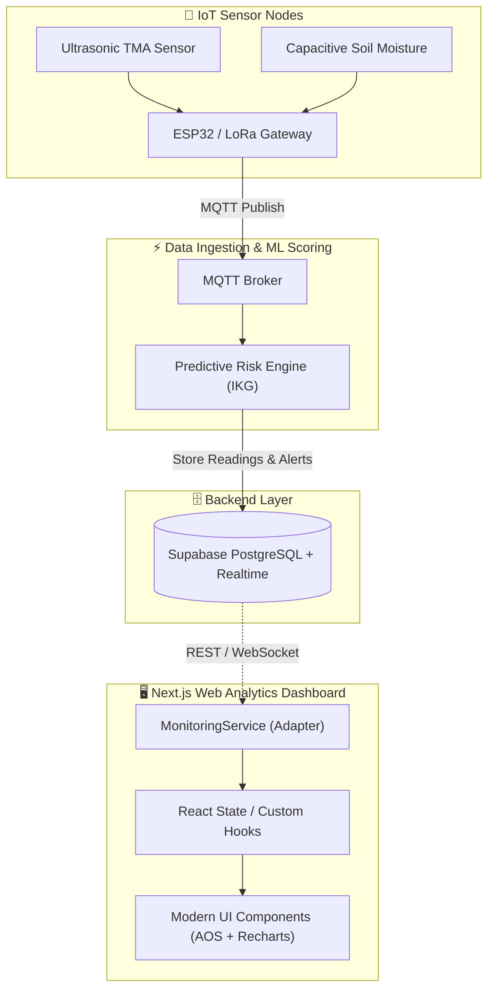

# 🌿 Peatland Hydrological Analytics Dashboard

> **Integrated IoT-Web Analytics System**  
> *Sistem Pemodelan Prediktif Hidrologi untuk Peringatan Dini Kerentanan Lahan Gambut*  
> Berbasis **Next.js 16 (App Router)**, **React 19**, **TypeScript**, dan **Tailored Forest Design System**.

---

[](https://nextjs.org/)
[](https://react.dev/)
[](https://www.typescriptlang.org/)
[](https://recharts.org/)
[](https://michalsnik.github.io/aos/)
[](#arsitektur--aliran-data)

---

## 📌 Ringkasan Proyek

Kebakaran pada lahan gambut umumnya bertipe **smoldering fire** (kebakaran bawah permukaan) yang sulit dideteksi secara visual sebelum api muncul ke permukaan. Sistem ini memindahkan paradigma penanggulangan kebakaran hutan dan lahan (Karhutla) dari **deteksi reaktif** menuju **pemantauan preventif berbasis hidrologi**.

Dashboard web ini bertindak sebagai **lapisan presentasi & analitik hilir (downstream visualization layer)** dari jaringan sensor IoT lapangan yang mengukur:
1. **Tinggi Muka Air (TMA)** gambut (dalam centimeter terhadap permukaan tanah).
2. **Kelembaban Tanah (Soil Moisture)** pada kedalaman kritis perakaran.

Data tersebut diproses oleh backend dengan algoritma pemodelan prediktif menghasilkan **Indeks Kerentanan Gambut (IKG)** dengan kategori status berjenjang:
- 🟢 **AMAN** (IKG < 40)
- 🟡 **SIAGA** (40 ≤ IKG < 70)
- 🔴 **AWAS** (IKG ≥ 70)

---

## ✨ Fitur Utama

### 🌲 1. Forest Premium Design System (Anti-AI Slop)
- **Tema Visual Organik Hutan**: Palet hijau lumut tua (`#0a0f0a`, `#111a12`), border subtil berbasis alpha transparan, dan efek glassmorphism yang presisi.
- **Tipografi Berkelas**:
  - `Outfit`: Display & header utama berkarakter modern dan tegas.
  - `Inter`: Teks antarmuka dengan keterbacaan tinggi.
  - `JetBrains Mono`: Penyajian angka metrik telemetri, koordinat sensor, dan ID node.
- **Micro-interactions & AOS Animations**: Staggered scroll animations, pulse rings pada status node aktif, serta transisi hover yang halus.

### 🌗 2. Dark & Light Mode dengan Zero-Flicker
- Toggle tema di header dan sidebar dengan dukungan auto-detect preferensi OS (`prefers-color-scheme`).
- Anti-flash script inline di `<head>` untuk mencegah efek *flicker* saat pemuatan halaman pertama kali.
- Penyimpanan status tema persisten pada `localStorage`.

### 📊 3. Analitik Interaktif & Monitoring Hidrologi
- **Area & Line Charts (Recharts)** dengan custom linear gradients dan rich interactive tooltips.
- **Water Level Gauge**: Representasi visual level air terhadap ambang batas kritis gambut (-40 cm).
- **Segmented Soil Moisture Bar**: 4 zona kelembaban terintegrasi (*Kering*, *Rendah*, *Normal*, *Lembab*).
- **Timeframe Selector**: Filter data rentang 24 Jam, 7 Hari, dan 30 Hari secara reaktif.

### 🛡️ 4. Early Warning System (Alert Center)
- Pusat notifikasi peringatan dini dengan klasifikasi prioritas tingkat bahaya (**AWAS**, **SIAGA**, **AMAN**).
- Fitur konfirmasi (Acknowledge alert) dan filter status aktif/arsip.

### 📡 5. Fleet Monitoring Multi-Node
- Daftar inventaris seluruh stasiun node sensor IoT di berbagai blok gambut.
- Indikator status jaringan real-time (`ONLINE` / `OFFLINE` / `UNKNOWN`), level baterai, koordinat GPS, dan timestamp telemetri terakhir.
- Halaman detail komprehensif per node (`/monitoring/[nodeId]`) dilengkapi histori pembacaan sensor.

### 📱 6. Desain Ultra-Responsif
- **Desktop (>1024px)**: Layout sidebar 240px dengan dashboard grid multi-kolom.
- **Tablet (768px - 1024px)**: Grid 2-kolom dengan penyusutan proporsional.
- **Mobile (≤768px)**: Off-canvas drawer menu, tombol hamburger ramah sentuhan, dan susunan kartu tumpuk vertikal satu kolom.

---

## 🏛️ Arsitektur & Aliran Data

Frontend dibangun dengan prinsip **Presentation-First & Backend Adapter Pattern** sesuai spesifikasi dokumen [arsitektur.md](../arsitektur.md):



### Keunggulan Arsitektur:
1. **Decoupled dari Database**: Komponen UI tidak bergantung langsung pada nama tabel, query SQL, atau schema Supabase.
2. **Interface Domain Bersih**: Seluruh data yang mengalir ke komponen UI mengacu pada tipe kontrak di `src/types/domain.ts`.
3. **Plug-and-Play Backend**: Tim backend dapat mengganti `mocks/mockData.ts` dengan Supabase Client resmi hanya dengan mengedit implementasi di `src/features/monitoring/services/monitoringService.ts`.

---

## 📂 Struktur Direktori

```text
peatland-dashboard/
├── public/                     # Static assets & favicon
├── src/
│   ├── app/                    # Next.js App Router
│   │   ├── alerts/             # Halaman Alert Center
│   │   ├── dashboard/          # Alias / Redirect ke root dashboard
│   │   ├── monitoring/         # Fleet monitoring & [nodeId] dynamic route
│   │   ├── globals.css         # Forest design system, tokens, CSS variables
│   │   ├── layout.tsx          # Root layout & providers
│   │   └── page.tsx            # Main executive dashboard
│   ├── components/
│   │   ├── alerts/             # AlertsClient & item components
│   │   ├── charts/             # AreaChart, LineChart, ChartSkeleton
│   │   ├── dashboard/          # Metric cards (WaterLevel, SoilMoisture, RiskSummary)
│   │   ├── layout/             # AppLayout, Sidebar, AppHeader
│   │   ├── monitoring/         # MonitoringClient, NodeDetailClient, NodeCard
│   │   ├── providers/          # AOS Provider & Theme context
│   │   ├── status/             # StatusBadge, ConnectionStatus
│   │   └── ui/                 # Skeletons, ErrorState, EmptyState
│   ├── features/
│   │   └── monitoring/
│   │       └── services/       # monitoringService.ts (Backend Adapter Layer)
│   ├── lib/
│   │   └── constants/          # App constants, risk thresholds, formatter helpers
│   ├── mocks/
│   │   └── mockData.ts         # Realistic mock dataset (Nodes, Readings, Trends, Alerts)
│   └── types/
│       └── domain.ts           # Domain contract types (RiskStatus, MonitoringReading, dll)
├── package.json
├── tsconfig.json
└── README.md
```

---

## 🚀 Panduan Memulai (Getting Started)

### Prasyarat
- **Node.js**: Versi `18.18.0` atau yang lebih baru (disarankan LTS `v20.x`)
- **Package Manager**: `npm`, `pnpm`, atau `yarn`

### Instalasi & Menjalankan Lokal

1. **Clone repositori**:
   ```bash
   git clone https://github.com/username/LPPM-Peatland-Analytics.git
   cd LPPM-Peatland-Analytics/peatland-dashboard
   ```

2. **Pasang dependensi**:
   ```bash
   npm install
   ```

3. **Jalankan development server**:
   ```bash
   npm run dev
   ```

4. **Buka di peramban**:
   Akses [http://localhost:3000](http://localhost:3000) untuk melihat antarmuka dashboard.

---

## 🛠️ Perintah Skrip Tersedia

| Skrip | Deskripsi |
|---|---|
| `npm run dev` | Menjalankan Next.js development server pada port 3000 |
| `npm run build` | Melakukan kompilasi produksi aplikasi |
| `npm run start` | Menjalankan server aplikasi hasil build produksi |
| `npm run lint` | Menjalankan pemeriksaan linter ESLint |

---

## 🔌 Panduan Integrasi Backend (Supabase / Live API)

Untuk menghubungkan dashboard dengan database Supabase atau backend live:

1. **Pasang Supabase JS SDK** (opsional):
   ```bash
   npm install @supabase/supabase-js
   ```

2. **Atur Environment Variables** pada file `.env.local`:
   ```env
   NEXT_PUBLIC_SUPABASE_URL=https://your-project.supabase.co
   NEXT_PUBLIC_SUPABASE_ANON_KEY=your-anon-key
   NEXT_PUBLIC_USE_MOCK_DATA=false
   ```

3. **Sesuaikan Adapter Service**:
   Buka file `src/features/monitoring/services/monitoringService.ts`. Ubah fungsi pengambilan data agar melakukan query langsung ke Supabase atau REST API tanpa perlu menyentuh komponen UI:
   ```typescript
   export const monitoringService = {
     async getSystemStatus(): Promise<SystemStatus> {
       if (process.env.NEXT_PUBLIC_USE_MOCK_DATA === "true") {
         return mockSystemStatus;
       }
       // Hubungkan dengan Supabase client di sini:
       // const { data } = await supabase.from('system_health').select('*').single();
       // return mapToSystemStatus(data);
     },
     // ...
   };
   ```

---

## 📐 Klasifikasi Indeks Risiko & Ambang Batas

Berdasarkan formulasi riset hidrologi gambut:

| Status | Rentang IKG | Parameter TMA | Kelembaban Tanah | Rekomendasi Lapangan |
|---|---|---|---|---|
| 🟢 **AMAN** | `0 - 39` | > -20 cm | > 60% | Kondisi hidrologi basah terjaga; pemantauan rutin standar. |
| 🟡 **SIAGA** | `40 - 69` | -20 s/d -40 cm | 40% - 60% | Muka air menyusut mendekati batas kritis; patroli MPA diintensifkan. |
| 🔴 **AWAS** | `≥ 70` | < -40 cm | < 40% | Gambut kering rentan menyala; lakukan pembasahan (re-wetting) & siaga regu pemadam. |

---

## 👥 Tim & Kontribusi

Proyek ini dikembangkan dalam lingkup penelitian dan pengabdian LPPM untuk pemantauan mitigasi risiko bencana kebakaran hutan dan lahan gambut tropis.

- **Frontend Development**: Next.js & UI/UX Forest Analytics Team
- **IoT & Sensor Ingestion**: Hardware & Telemetry Division
- **Predictive Modeling**: LPPM Peatland Research Group

---

## 📄 Lisensi

Hak Cipta © 2026 Tim Peneliti LPPM. Seluruh hak cipta dilindungi undang-undang.
